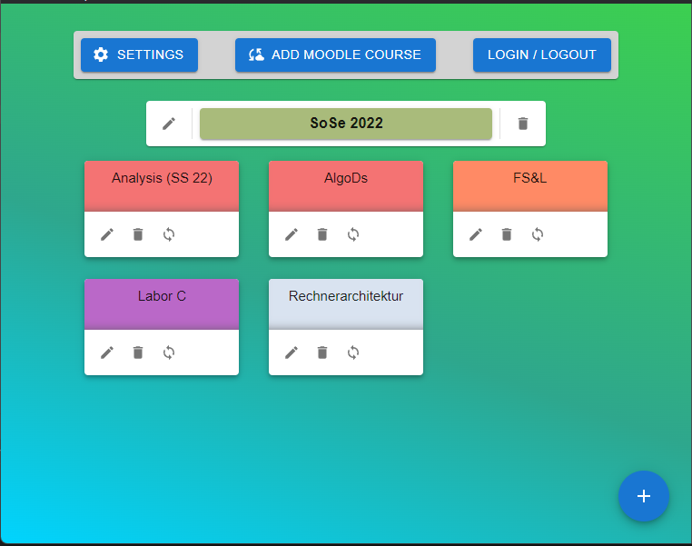
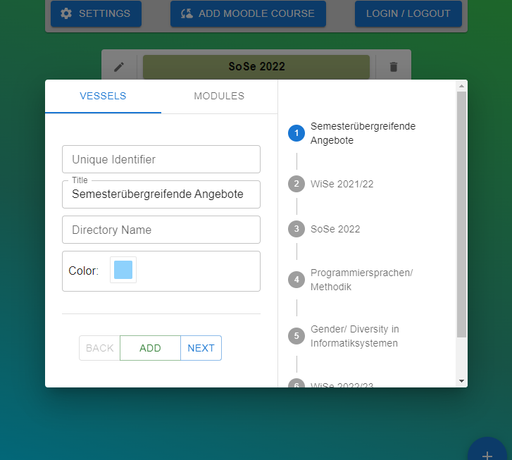
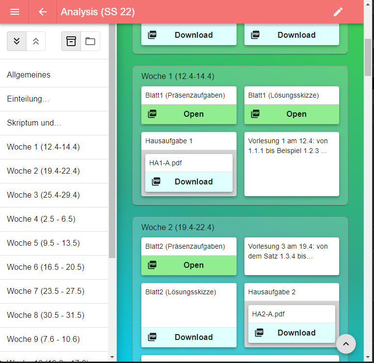

# UniMa (WIP)
> Personal download and organizing manager for the learning platform moodle.

## About

This is an electron based windows application for viewing, organizing and downloading files and assignments from the learning platform moodle.
This is a small personal project of myself, not intended for bigger user.

## The App
The main focus of this app to easily download files from moodle and organize them on your file system how you want.
This is archived by hooking up to the moodle API, requesting and analyzing the data of the user and then providing
the user, an interface for directly downloading files from moodle and storing them with the help of the file system,
with one simple click.

---
### Main Page
The main page is the entry point of the application after a quick login to moodle itself. This page shows all courses selected
by the user to be analyzed by UniMa. With the "Add Moodle Course" button, new courses can be added.

---

### Discover Page
This page provides a way to select the courses UniMa should analyze. It shows all moodle courses the user is enrolled to.

---

### Course Page
The mainly used page of UniMa. Here the content of a course can be seen, files downloaded and files opened. The drawer to 
the left can be used to navigate to the different sections of the course page. "Not all entries of a moodle course are currently 
supported by UniMa."

---

## Tech Stack
Programming Language: [JavaScript / mainly TypeScript](https://www.typescriptlang.org/)  
Module Bundler: [Webpack](https://github.com/webpack/webpack)  
Platfrom Framework: [Electron](https://www.electronjs.org/de/)  
UI Framework: [React](https://reactjs.org/), [MUI](https://mui.com/)  
State Managment: [Redux](https://redux.js.org/)  

---
## License
Copyright (c) 2022 Larson Schneider 
Licensed under the MIT license.
